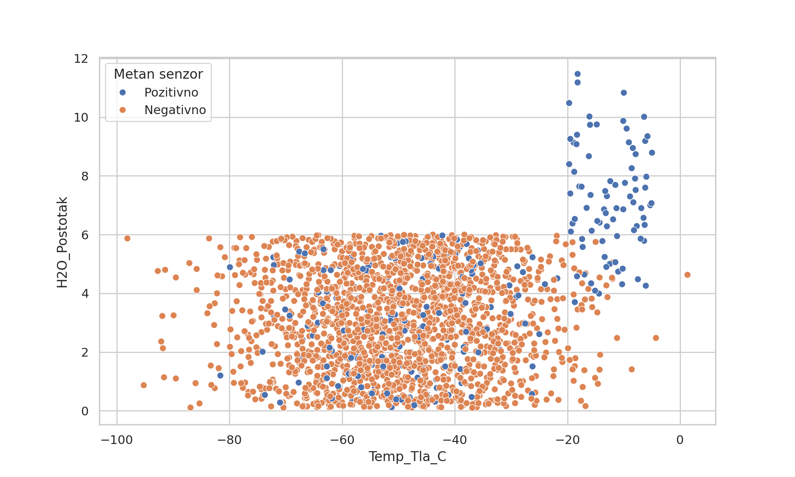
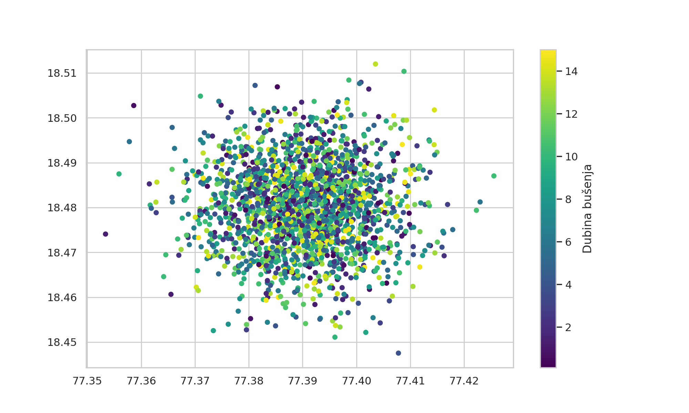
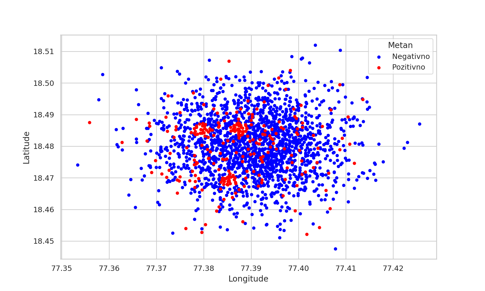
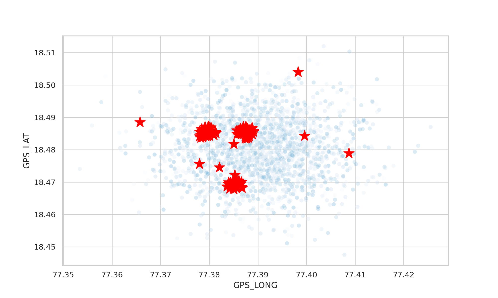
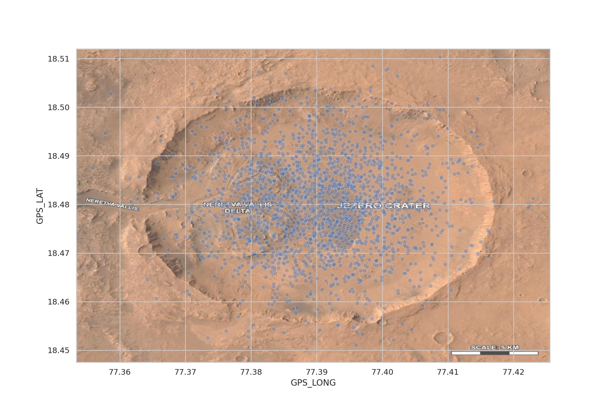

# Misija Nexus – Tehnička dokumentacija projekta

## Izvršni sažetak (Executive Summary)

Projekt *Misija Nexus* predstavlja integrirani analitički sustav za identifikaciju optimalnih lokacija za bušenje unutar kratera Jezero na Marsu. Primarni cilj sustava je obrada i interpretacija telemetrijskih podataka prikupljenih putem senzora na površini Marsa, s naglaskom na detekciju uvjeta koji potencijalno ukazuju na prisutnost vode i organskih spojeva.

Ulazni podaci dolaze iz dva odvojena izvora: geoprostornih koordinata i senzorskih očitanja. Korištenjem Python ekosustava (Pandas, Matplotlib, Seaborn), razvijen je pipeline koji:

* konsolidira podatke u jedinstveni analitički model,
* uklanja anomalije uzrokovane senzorskim šumom,
* generira višeslojne vizualizacije za geoprostornu interpretaciju,
* automatski generira JSON naloge za autonomne robotske sustave.

Konačni rezultat sustava je strukturirani skup “kandidata za bušenje” koji zadovoljavaju stroge znanstvene kriterije i spremni su za daljnju operativnu obradu putem mrežnog uplinka.

---

## Arhitektura repozitorija

Projekt je organiziran prema standardiziranoj hijerarhiji kako bi se omogućila jasna separacija podataka, koda i rezultata:

* `data/`
  Sadrži izvorne CSV datoteke (`mars_lokacije.csv`, `mars_uzorci.csv`).

* `src/`
  Python skripte za obradu podataka, vizualizaciju i generiranje JSON paketa.

* `assets/`
  Generirani grafovi i satelitske snimke korištene u vizualizaciji.

* `README.md`
  Glavna dokumentacija projekta.

Ovakva struktura omogućuje skalabilnost, lakšu nadogradnju i jasnu podjelu odgovornosti unutar sustava.

---

## Metodologija obrade podataka (Data Wrangling)

### Učitavanje i standardizacija podataka

Podaci su učitani korištenjem Pandas biblioteke uz posebnu pažnju na formatiranje:

* separator: `;`
* decimalni zapis: `,`

Ova prilagodba je ključna jer pogrešna interpretacija formata može dovesti do krivih tipova podataka i neispravnih analiza.

### Spajanje datasetova

Podaci iz dvije datoteke spojeni su korištenjem relacijskog modela preko atributa `ID_Uzorka`. Time je formiran jedinstveni DataFrame koji objedinjuje:

* prostorne podatke (GPS)
* fizikalno-kemijske parametre tla

### Detekcija i uklanjanje anomalija

Zbog ekstremnih uvjeta na Marsu, senzori mogu generirati nelogične vrijednosti. Kako bi se osigurala analitička pouzdanost, implementirani su strogi validacijski uvjeti:

* temperatura tla ∈ [-100, 40]
* pH vrijednost ∈ [0, 14]
* udio vode ∈ [0, 100]

Zapisi koji ne zadovoljavaju ove uvjete klasificirani su kao anomalije i izdvojeni u zasebnu datoteku. Ovaj korak značajno smanjuje utjecaj šuma i povećava kvalitetu modela.

### Razdvajanje podataka

Rezultat obrade:

* `cisti_podaci.csv` → validirani podaci za analizu
* `anomalije.csv` → zapis grešaka za dodatnu inspekciju

---

## Geoprostorna analiza i vizualizacija

Vizualizacija predstavlja ključni alat za interpretaciju podataka i donošenje odluka.

### Graf 1 – Korelacija temperature i vode



Prikazuje odnos između temperature tla i postotka vode. Boja označava prisutnost metana. Uočava se da se pozitivna očitanja metana češće pojavljuju u određenim temperaturnim rasponima.

---

### Graf 2 – Dubina bušenja (geoprostorna distribucija)



Boja točaka predstavlja dubinu bušenja. Ova vizualizacija omogućuje identifikaciju područja gdje su potrebne dublje analize.

---

### Graf 3 – Distribucija metana



Jasna klasifikacija:

* crveno → pozitivno
* plavo → negativno

Ovaj graf služi kao primarni indikator potencijalnih bioloških aktivnosti.

---

### Graf 4 – Kandidati za bušenje



Kandidati su definirani kao lokacije koje zadovoljavaju:

* prisutnost metana
* prisutnost organskih molekula

Označeni su velikim crvenim zvjezdicama radi vizualne jasnoće.

---

### Graf 5 – Misijska karta (satelitski overlay)



Ovaj graf uvodi napredni koncept **extent mapiranja**.

#### Tehničko objašnjenje:

Funkcija `imshow()` zahtijeva definiranje granica slike u koordinatnom sustavu grafa. Te granice (`extent`) određuju:

```
[X_min, X_max, Y_min, Y_max]
```

Izračunavanjem minimuma i maksimuma GPS koordinata omogućeno je precizno “lijepljenje” satelitske snimke na stvarne podatke.

Bez ovog koraka:

* podaci bi bili pogrešno pozicionirani
* karta bi bila neupotrebljiva za navigaciju

Ova metoda omogućuje realističan prikaz terena i ključna je za operativno planiranje.

---

## Identifikacija kandidata

Kandidati za bušenje definirani su pomoću logičkog filtra:

* `Metan_Senzor == "Pozitivno"`
* `Organske_Molekule == "Da"`

Ova kombinacija predstavlja najjači indikator potencijalne biološke aktivnosti.

---

## Komunikacijski protokol (JSON Uplink)

Nakon identifikacije kandidata, generira se JSON paket koji služi kao ulaz za robotski sustav.

### Primjer strukture:

```json
{
  "kandidati": [
    {
      "ID_Uzorka": 12345,
      "GPS_LAT": 12.3456,
      "GPS_LONG": 98.7654,
      "akcije": [
        { "tip": "NAVIGACIJA" },
        { "tip": "SONDIRANJE" },
        { "tip": "SLANJE_PODATAKA" }
      ]
    }
  ]
}
```

### Logika generiranja

Umjesto ručnog definiranja, koristi se iteracija kroz DataFrame (`iterrows()`), čime se:

* automatizira proces
* smanjuje mogućnost greške
* omogućuje skalabilnost

Svaki kandidat dobiva tri standardizirane akcije:

1. NAVIGACIJA
2. SONDIRANJE
3. SLANJE_PODATAKA

---

## Inženjerski dnevnik (Troubleshooting Log)

### Problem 1: Neispravno učitavanje CSV datoteka

**Uzrok:** Pogrešan separator i decimalni znak
**Simptom:** Krivi tipovi podataka (string umjesto float)
**Rješenje:** Definiranje `sep=";"` i `decimal=","` prilikom učitavanja

---

### Problem 2: Neispravno spajanje tablica

**Uzrok:** Nepodudarni tipovi stupca `ID_Uzorka`
**Simptom:** Prazni ili nepotpuni merge rezultat
**Rješenje:** Eksplicitno osiguravanje istog tipa podataka prije spajanja

---

### Problem 3: Nedostatak legendi na grafovima

**Uzrok:** Korištenje `plt.scatter()` bez `label` parametra
**Rješenje:** Dodavanje `label` i `plt.legend()` za interpretabilnost

---

### Problem 4: Pogrešno pozicionirana satelitska slika

**Uzrok:** Neispravno definiran `extent`
**Rješenje:** Izračun granica iz stvarnih GPS podataka

---

## Zaključak

Misija Nexus demonstrira kako se kombinacijom obrade podataka, vizualizacije i automatizacije može razviti robustan sustav za podršku istraživačkim misijama. Sustav je dizajniran modularno i skalabilno, što omogućuje njegovu primjenu i u drugim analitičkim scenarijima.

Korištenjem standardiziranih inženjerskih praksi i jasne dokumentacije, projekt omogućuje jednostavno razumijevanje, replikaciju i daljnji razvoj od strane drugih stručnjaka.
